# AI-DLC 적응형 워크플로우 개요

**목적**: AI 모델과 개발자가 전체 워크플로우 구조를 이해하기 위한 기술 참조 문서.

**참고**: 유사한 콘텐츠가 core-workflow.md (사용자 환영 메시지)와 README.md (문서)에 존재합니다. 이 중복은 의도적입니다 - 각 파일은 다른 목적을 제공합니다:
- **이 파일**: AI 모델 컨텍스트 로딩을 위한 Mermaid 다이어그램이 포함된 상세 기술 참조
- **core-workflow.md**: ASCII 다이어그램이 포함된 사용자 대면 환영 메시지
- **README.md**: 저장소를 위한 사람이 읽을 수 있는 문서

## 3단계 생명주기:
- **INCEPTION 단계**: 계획 및 아키텍처 (워크스페이스 감지 + 조건부 단계 + 워크플로우 계획)
- **CONSTRUCTION 단계**: 설계, 구현, 빌드 및 테스트 (유닛별 설계 + 코드 계획/생성 + 빌드 및 테스트)
- **OPERATIONS 단계**: 향후 배포 및 모니터링 워크플로우를 위한 플레이스홀더

## 적응형 워크플로우:
- **워크스페이스 감지** (항상) → **역공학** (브라운필드만) → **요구사항 분석** (항상, 적응형 깊이) → **조건부 단계** (필요시) → **워크플로우 계획** (항상) → **코드 생성** (항상, 유닛별) → **빌드 및 테스트** (항상)

## 작동 방식:
- **AI가 분석**합니다 - 요청, 워크스페이스, 복잡성을 분석하여 필요한 스테이지 결정
- **항상 실행되는 스테이지**: 워크스페이스 감지, 요구사항 분석 (적응형 깊이), 워크플로우 계획, 코드 생성 (유닛별), 빌드 및 테스트
- **다른 모든 스테이지는 조건부**: 역공학, 사용자 스토리, 애플리케이션 설계, 유닛 생성, 유닛별 설계 스테이지 (기능 설계, NFR 요구사항, NFR 설계, 인프라 설계)
- **고정된 순서 없음**: 스테이지는 특정 작업에 맞는 순서로 실행

## 팀의 역할:
- **질문에 답변** - 전용 질문 파일에서 [Answer]: 태그와 문자 선택 (A, B, C, D, E) 사용
- **옵션 E 사용 가능**: 제공된 옵션이 맞지 않으면 "기타"를 선택하고 사용자 정의 응답 설명
- **팀으로 협력**하여 진행하기 전에 각 단계를 검토하고 승인
- **공동으로 결정** - 필요할 때 아키텍처 접근 방식 결정
- **중요**: 이것은 팀 작업입니다 - 각 단계에 관련 이해관계자를 참여시키세요

## AI-DLC 3단계 워크플로우:

```mermaid
flowchart TD
    Start(["사용자 요청"])

    subgraph INCEPTION["🔵 INCEPTION 단계"]
        WD["워크스페이스 감지<br/><b>항상</b>"]
        RE["역공학<br/><b>조건부</b>"]
        RA["요구사항 분석<br/><b>항상</b>"]
        Stories["사용자 스토리<br/><b>조건부</b>"]
        WP["워크플로우 계획<br/><b>항상</b>"]
        AppDesign["애플리케이션 설계<br/><b>조건부</b>"]
        UnitsG["유닛 생성<br/><b>조건부</b>"]
    end

    subgraph CONSTRUCTION["🟢 CONSTRUCTION 단계"]
        FD["기능 설계<br/><b>조건부</b>"]
        NFRA["NFR 요구사항<br/><b>조건부</b>"]
        NFRD["NFR 설계<br/><b>조건부</b>"]
        ID["인프라 설계<br/><b>조건부</b>"]
        CG["코드 생성<br/><b>항상</b>"]
        BT["빌드 및 테스트<br/><b>항상</b>"]
    end

    subgraph OPERATIONS["🟡 OPERATIONS 단계"]
        OPS["Operations<br/><b>플레이스홀더</b>"]
    end

    Start --> WD
    WD -.-> RE
    WD --> RA
    RE --> RA

    RA -.-> Stories
    RA --> WP
    Stories --> WP

    WP -.-> AppDesign
    WP -.-> UnitsG
    AppDesign -.-> UnitsG
    UnitsG --> FD
    FD -.-> NFRA
    NFRA -.-> NFRD
    NFRD -.-> ID

    WP --> CG
    FD --> CG
    NFRA --> CG
    NFRD --> CG
    ID --> CG
    CG -.->|다음 유닛| FD
    CG --> BT
    BT -.-> OPS
    BT --> End(["완료"])

    style WD fill:#4CAF50,stroke:#1B5E20,stroke-width:3px,color:#fff
    style RA fill:#4CAF50,stroke:#1B5E20,stroke-width:3px,color:#fff
    style WP fill:#4CAF50,stroke:#1B5E20,stroke-width:3px,color:#fff

    style CG fill:#4CAF50,stroke:#1B5E20,stroke-width:3px,color:#fff
    style BT fill:#4CAF50,stroke:#1B5E20,stroke-width:3px,color:#fff
    style OPS fill:#BDBDBD,stroke:#424242,stroke-width:2px,stroke-dasharray: 5 5,color:#000
    style RE fill:#FFA726,stroke:#E65100,stroke-width:3px,stroke-dasharray: 5 5,color:#000
    style Stories fill:#FFA726,stroke:#E65100,stroke-width:3px,stroke-dasharray: 5 5,color:#000
    style AppDesign fill:#FFA726,stroke:#E65100,stroke-width:3px,stroke-dasharray: 5 5,color:#000

    style UnitsG fill:#FFA726,stroke:#E65100,stroke-width:3px,stroke-dasharray: 5 5,color:#000
    style FD fill:#FFA726,stroke:#E65100,stroke-width:3px,stroke-dasharray: 5 5,color:#000
    style NFRA fill:#FFA726,stroke:#E65100,stroke-width:3px,stroke-dasharray: 5 5,color:#000
    style NFRD fill:#FFA726,stroke:#E65100,stroke-width:3px,stroke-dasharray: 5 5,color:#000
    style ID fill:#FFA726,stroke:#E65100,stroke-width:3px,stroke-dasharray: 5 5,color:#000
    style INCEPTION fill:#BBDEFB,stroke:#1565C0,stroke-width:3px, color:#000
    style CONSTRUCTION fill:#C8E6C9,stroke:#2E7D32,stroke-width:3px, color:#000
    style OPERATIONS fill:#FFF59D,stroke:#F57F17,stroke-width:3px, color:#000
    style Start fill:#CE93D8,stroke:#6A1B9A,stroke-width:3px,color:#000
    style End fill:#CE93D8,stroke:#6A1B9A,stroke-width:3px,color:#000

    linkStyle default stroke:#333,stroke-width:2px
```

**스테이지 설명:**

**🔵 INCEPTION 단계** - 계획 및 아키텍처
- 워크스페이스 감지: 워크스페이스 상태 및 프로젝트 유형 분석 (항상)
- 역공학: 기존 코드베이스 분석 (조건부 - 브라운필드만)
- 요구사항 분석: 요구사항 수집 및 검증 (항상 - 적응형 깊이)
- 사용자 스토리: 사용자 스토리 및 페르소나 생성 (조건부)
- 워크플로우 계획: 실행 계획 생성 (항상)
- 애플리케이션 설계: 고수준 컴포넌트 식별 및 서비스 레이어 설계 (조건부)
- 유닛 생성: 작업 단위로 분해 (조건부)

**🟢 CONSTRUCTION 단계** - 설계, 구현, 빌드 및 테스트
- 기능 설계: 유닛별 상세 비즈니스 로직 설계 (조건부, 유닛별)
- NFR 요구사항: NFR 결정 및 기술 스택 선택 (조건부, 유닛별)
- NFR 설계: NFR 패턴 및 논리적 컴포넌트 통합 (조건부, 유닛별)
- 인프라 설계: 실제 인프라 서비스에 매핑 (조건부, 유닛별)
- 코드 생성: 파트 1 - 계획, 파트 2 - 생성으로 코드 생성 (항상, 유닛별)
- 빌드 및 테스트: 모든 유닛 빌드 및 포괄적 테스트 실행 (항상)

**🟡 OPERATIONS 단계** - 플레이스홀더
- Operations: 향후 배포 및 모니터링 워크플로우를 위한 플레이스홀더 (플레이스홀더)

**핵심 원칙:**
- 단계는 가치를 더할 때만 실행
- 각 단계는 독립적으로 평가
- INCEPTION은 "무엇"과 "왜"에 집중
- CONSTRUCTION은 "어떻게" + "빌드 및 테스트"에 집중
- OPERATIONS는 향후 확장을 위한 플레이스홀더
- 단순한 변경은 조건부 INCEPTION 스테이지를 건너뛸 수 있음
- 복잡한 변경은 전체 INCEPTION 및 CONSTRUCTION 처리를 받음
