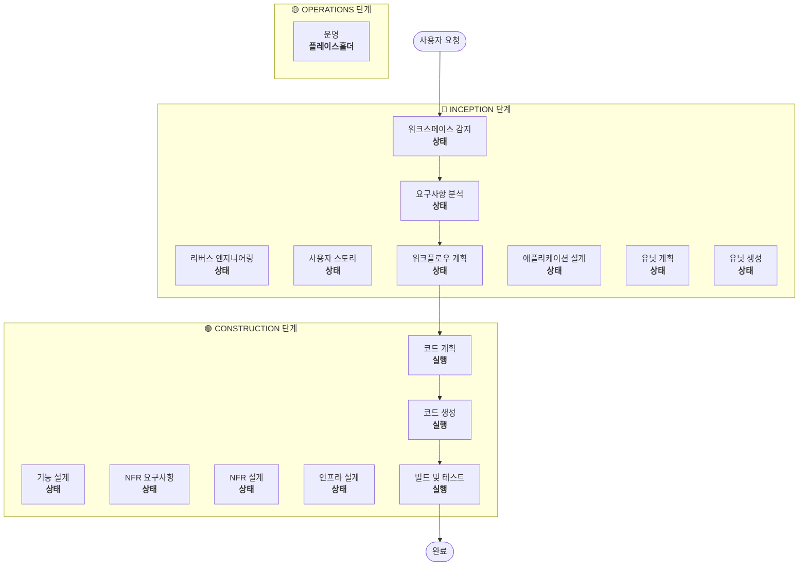

# 워크플로우 계획

**목적**: 실행할 단계를 결정하고 포괄적인 실행 계획 생성

**항상 실행**: 이 단계는 요구사항과 범위를 이해한 후 항상 실행됨

## 단계 1: 모든 이전 컨텍스트 로드

### 1.1 리버스 엔지니어링 산출물 로드 (브라운필드인 경우)
- architecture.md
- component-inventory.md
- technology-stack.md
- dependencies.md

### 1.2 요구사항 분석 로드
- requirements.md (의도 분석 포함)
- requirement-verification-questions.md (답변 포함)

### 1.3 사용자 스토리 로드 (실행된 경우)
- stories.md
- personas.md

## 단계 2: 상세 범위 및 영향 분석

**이제 완전한 컨텍스트 (요구사항 + 스토리)가 있으므로 상세 분석 수행:**

### 2.1 변환 범위 감지 (브라운필드만 해당)

**브라운필드 프로젝트인 경우**, 변환 범위 분석:

#### 아키텍처 변환
- **단일 컴포넌트 변경** vs **아키텍처 변환**
- **인프라 변경** vs **애플리케이션 변경**
- **배포 모델 변경** (Lambda→Container, EC2→Serverless 등)

#### 관련 컴포넌트 식별
변환의 경우 다음을 식별:
- 업데이트가 필요한 **인프라 코드**
- 변경이 필요한 **CDK 스택**
- **API Gateway** 구성
- **로드 밸런서** 요구사항
- 필요한 **네트워킹** 변경
- **모니터링/로깅** 적응

#### 패키지 간 영향
- 업데이트가 필요한 **CDK 인프라** 패키지
- 버전 업데이트가 필요한 **공유 모델**
- 엔드포인트 변경이 필요한 **클라이언트 라이브러리**
- 새 테스트 시나리오가 필요한 **테스트 패키지**

### 2.2 변경 영향 평가

#### 영향 영역
1. **사용자 대면 변경**: 사용자 경험에 영향을 미치는가?
2. **구조적 변경**: 시스템 아키텍처를 변경하는가?
3. **데이터 모델 변경**: 데이터베이스 스키마 또는 데이터 구조에 영향을 미치는가?
4. **API 변경**: 인터페이스 또는 계약에 영향을 미치는가?
5. **NFR 영향**: 성능, 보안 또는 확장성에 영향을 미치는가?

#### 애플리케이션 레이어 영향 (해당되는 경우)
- **코드 변경**: 새 진입점, 어댑터, 구성
- **의존성**: 새 라이브러리, 프레임워크 변경
- **구성**: 환경 변수, 구성 파일
- **테스트**: 단위 테스트, 통합 테스트

#### 인프라 레이어 영향 (해당되는 경우)
- **배포 모델**: Lambda→ECS, EC2→Fargate 등
- **네트워킹**: VPC, 보안 그룹, 로드 밸런서
- **스토리지**: 영구 볼륨, 공유 스토리지
- **스케일링**: 오토스케일링 정책, 용량 계획

#### 운영 레이어 영향 (해당되는 경우)
- **모니터링**: CloudWatch, 사용자 정의 메트릭, 대시보드
- **로깅**: 로그 집계, 구조화된 로깅
- **알림**: 알람 구성, 알림 채널
- **배포**: CI/CD 파이프라인 변경, 롤백 전략

### 2.3 컴포넌트 관계 매핑 (브라운필드만 해당)

**브라운필드 프로젝트인 경우**, 컴포넌트 의존성 그래프 생성:

```markdown
## 컴포넌트 관계
- **기본 컴포넌트**: [변경되는 패키지]
- **인프라 컴포넌트**: [CDK/Terraform 패키지]
- **공유 컴포넌트**: [모델, 유틸리티, 클라이언트]
- **의존 컴포넌트**: [이 컴포넌트를 호출하는 서비스]
- **지원 컴포넌트**: [모니터링, 로깅, 배포]
```

각 관련 컴포넌트에 대해:
- **변경 유형**: 주요, 부수적, 구성만
- **변경 이유**: 직접 의존성, 배포 모델, 네트워킹
- **변경 우선순위**: 핵심, 중요, 선택

### 2.4 위험 평가

위험 수준 평가:
1. **낮음**: 격리된 변경, 쉬운 롤백, 잘 이해됨
2. **중간**: 여러 컴포넌트, 보통 롤백, 일부 미지수
3. **높음**: 시스템 전체 영향, 복잡한 롤백, 상당한 미지수
4. **치명적**: 프로덕션 핵심, 어려운 롤백, 높은 불확실성

## 단계 3: 단계 결정

### 3.1 사용자 스토리 - 이미 실행됨 또는 건너뛰기?
**이미 실행됨**: 다음 결정으로 이동
**실행되지 않음 - 다음 경우 실행**:
- 여러 사용자 페르소나
- 사용자 경험 영향
- 수락 기준 필요
- 팀 협업 필요

**다음 경우 건너뛰기**:
- 내부 리팩터링
- 명확한 재현이 있는 버그 수정
- 기술 부채 감소
- 인프라 변경

### 3.2 애플리케이션 설계 - 다음 경우 실행:
- 새 컴포넌트 또는 서비스 필요
- 컴포넌트 메서드 및 비즈니스 규칙 정의 필요
- 서비스 레이어 설계 필요
- 컴포넌트 의존성 명확화 필요

**다음 경우 건너뛰기**:
- 기존 컴포넌트 경계 내 변경
- 새 컴포넌트나 메서드 없음
- 순수 구현 변경

### 3.3 설계 (유닛 계획/생성) - 다음 경우 실행:
- 새 데이터 모델 또는 스키마
- API 변경 또는 새 엔드포인트
- 복잡한 알고리즘 또는 비즈니스 로직
- 상태 관리 변경
- 여러 패키지 변경 필요
- 코드형 인프라 업데이트 필요

**다음 경우 건너뛰기**:
- 단순 로직 변경
- UI만 변경
- 구성 업데이트
- 직관적인 구현

### 3.4 NFR 구현 - 다음 경우 실행:
- 성능 요구사항
- 보안 고려사항
- 확장성 우려
- 모니터링/관측성 필요

**다음 경우 건너뛰기**:
- 기존 NFR 설정이 충분
- 새 NFR 요구사항 없음
- NFR 영향이 없는 단순 변경

## 단계 4: 적응형 상세 기록

**적응형 깊이 설명은 [depth-levels.md](../common/depth-levels.md) 참조**

실행될 각 스테이지에 대해:
- 모든 정의된 산출물이 생성됨
- 산출물 내 상세 수준은 문제 복잡성에 따라 조정
- 모델이 문제 특성에 따라 적절한 상세 수준 결정

## 단계 5: 멀티 모듈 조정 분석 (브라운필드만 해당)

**여러 모듈/패키지가 있는 브라운필드인 경우**, 의존성을 분석하고 최적의 업데이트 전략 결정:

### 5.1 모듈 의존성 분석
- 빌드 시스템 의존성 및 의존성 매니페스트 검사
- 빌드 타임 vs 런타임 의존성 식별
- 모듈 간 API 계약 및 공유 인터페이스 매핑

### 5.2 업데이트 전략 결정
의존성 분석을 기반으로 결정:
- **업데이트 순서**: 의존성으로 인해 먼저 업데이트해야 하는 모듈
- **병렬화 기회**: 동시에 업데이트할 수 있는 모듈
- **조정 요구사항**: 버전 호환성, API 계약, 배포 순서
- **테스트 전략**: 모듈별 vs 통합 테스트 접근 방식
- **롤백 전략**: 중간 실패 시 복구 계획

### 5.3 조정 계획 문서화
```markdown
## 모듈 업데이트 전략
- **업데이트 접근 방식**: [순차/병렬/하이브리드]
- **핵심 경로**: [다른 업데이트를 차단하는 모듈]
- **조정 지점**: [공유 API, 인프라, 데이터 계약]
- **테스트 체크포인트**: [통합 검증 시점]
```

영향받는 각 모듈에 대해 식별:
- **업데이트 우선순위**: 먼저 업데이트해야 함 vs 나중에 업데이트 가능
- **의존성 제약**: 의존하는 것, 의존받는 것
- **변경 범위**: 주요 (호환성 파괴), 부수적 (호환), 패치 (수정)

## 단계 6: 워크플로우 시각화 생성

다음을 보여주는 Mermaid 플로우차트 생성:
- 순서대로 모든 단계
- 각 조건부 단계에 대한 실행 또는 건너뛰기 결정
- 각 단계 상태에 대한 적절한 스타일링

**스타일링 규칙** (플로우차트 뒤에 추가):
```
style WD fill:#4CAF50,stroke:#1B5E20,stroke-width:3px,color:#fff
style CP fill:#4CAF50,stroke:#1B5E20,stroke-width:3px,color:#fff
style CG fill:#4CAF50,stroke:#1B5E20,stroke-width:3px,color:#fff
style BT fill:#4CAF50,stroke:#1B5E20,stroke-width:3px,color:#fff
style US fill:#BDBDBD,stroke:#424242,stroke-width:2px,stroke-dasharray: 5 5,color:#000
style Start fill:#CE93D8,stroke:#6A1B9A,stroke-width:3px,color:#000
style End fill:#CE93D8,stroke:#6A1B9A,stroke-width:3px,color:#000

linkStyle default stroke:#333,stroke-width:2px
```

**스타일 가이드라인**:
- 완료됨/항상 실행: `fill:#4CAF50,stroke:#1B5E20,stroke-width:3px,color:#fff` (Material Green 흰색 텍스트)
- 조건부 실행: `fill:#FFA726,stroke:#E65100,stroke-width:3px,stroke-dasharray: 5 5,color:#000` (Material Orange 검은색 텍스트)
- 조건부 건너뛰기: `fill:#BDBDBD,stroke:#424242,stroke-width:2px,stroke-dasharray: 5 5,color:#000` (Material Gray 검은색 텍스트)
- 시작/끝: `fill:#CE93D8,stroke:#6A1B9A,stroke-width:3px,color:#000` (Material Purple 검은색 텍스트)
- 단계 컨테이너: 더 밝은 Material 색상 사용 (INCEPTION: #BBDEFB, CONSTRUCTION: #C8E6C9, OPERATIONS: #FFF59D)

## 단계 7: 실행 계획 문서 생성

`aidlc-docs/inception/plans/execution-plan.md` 생성:

```markdown
# 실행 계획

## 상세 분석 요약

### 변환 범위 (브라운필드만 해당)
- **변환 유형**: [단일 컴포넌트/아키텍처/인프라]
- **주요 변경**: [설명]
- **관련 컴포넌트**: [목록]

### 변경 영향 평가
- **사용자 대면 변경**: [예/아니오 - 설명]
- **구조적 변경**: [예/아니오 - 설명]
- **데이터 모델 변경**: [예/아니오 - 설명]
- **API 변경**: [예/아니오 - 설명]
- **NFR 영향**: [예/아니오 - 설명]

### 컴포넌트 관계 (브라운필드만 해당)
[컴포넌트 의존성 그래프]

### 위험 평가
- **위험 수준**: [낮음/중간/높음/치명적]
- **롤백 복잡성**: [쉬움/보통/어려움]
- **테스트 복잡성**: [단순/보통/복잡]

## 워크플로우 시각화



**참고**: 상태 플레이스홀더를 실제 단계 상태 (완료/건너뛰기/실행)로 교체하고 적절한 스타일링 적용

## 실행할 단계

### 🔵 INCEPTION 단계
- [x] 워크스페이스 감지 (완료)
- [x] 리버스 엔지니어링 (완료/건너뛰기)
- [x] 요구사항 정교화 (완료)
- [x] 사용자 스토리 (완료/건너뛰기)
- [x] 실행 계획 (진행 중)
- [ ] 애플리케이션 설계 - [실행/건너뛰기]
  - **근거**: [실행 또는 건너뛰기 이유]
- [ ] 유닛 계획 - [실행/건너뛰기]
  - **근거**: [실행 또는 건너뛰기 이유]
- [ ] 유닛 생성 - [실행/건너뛰기]
  - **근거**: [실행 또는 건너뛰기 이유]

### 🟢 CONSTRUCTION 단계
- [ ] 기능 설계 - [실행/건너뛰기]
  - **근거**: [실행 또는 건너뛰기 이유]
- [ ] NFR 요구사항 - [실행/건너뛰기]
  - **근거**: [실행 또는 건너뛰기 이유]
- [ ] NFR 설계 - [실행/건너뛰기]
  - **근거**: [실행 또는 건너뛰기 이유]
- [ ] 인프라 설계 - [실행/건너뛰기]
  - **근거**: [실행 또는 건너뛰기 이유]
- [ ] 코드 계획 - 실행 (항상)
  - **근거**: 구현 접근 방식 필요
- [ ] 코드 생성 - 실행 (항상)
  - **근거**: 코드 구현 필요
- [ ] 빌드 및 테스트 - 실행 (항상)
  - **근거**: 빌드, 테스트 및 검증 필요

### 🟡 OPERATIONS 단계
- [ ] 운영 - 플레이스홀더
  - **근거**: 향후 배포 및 모니터링 워크플로우

## 패키지 변경 순서 (브라운필드만 해당)
[해당되는 경우 의존성과 함께 패키지 업데이트 순서 나열]

## 예상 일정
- **총 단계**: [숫자]
- **예상 기간**: [시간 추정]

## 성공 기준
- **주요 목표**: [주된 목적]
- **핵심 산출물**: [목록]
- **품질 게이트**: [목록]

[브라운필드인 경우]
- **통합 테스트**: 모든 컴포넌트가 함께 작동
- **운영 준비**: 모니터링, 로깅, 알림 작동
```

## 단계 8: 상태 추적 초기화

`aidlc-docs/aidlc-state.md` 업데이트:

```markdown
# AI-DLC 상태 추적

## 프로젝트 정보
- **프로젝트 유형**: [그린필드/브라운필드]
- **시작 날짜**: [ISO 타임스탬프]
- **현재 스테이지**: INCEPTION - 워크플로우 계획

## 실행 계획 요약
- **총 스테이지**: [숫자]
- **실행할 스테이지**: [목록]
- **건너뛸 스테이지**: [이유와 함께 목록]

## 스테이지 진행 상황

### 🔵 INCEPTION 단계
- [x] 워크스페이스 감지
- [x] 리버스 엔지니어링 (해당되는 경우)
- [x] 요구사항 분석
- [x] 사용자 스토리 (해당되는 경우)
- [x] 워크플로우 계획
- [ ] 애플리케이션 설계 - [실행/건너뛰기]
- [ ] 유닛 계획 - [실행/건너뛰기]
- [ ] 유닛 생성 - [실행/건너뛰기]

### 🟢 CONSTRUCTION 단계
- [ ] 기능 설계 - [실행/건너뛰기]
- [ ] NFR 요구사항 - [실행/건너뛰기]
- [ ] NFR 설계 - [실행/건너뛰기]
- [ ] 인프라 설계 - [실행/건너뛰기]
- [ ] 코드 계획 - 실행
- [ ] 코드 생성 - 실행
- [ ] 빌드 및 테스트 - 실행

### 🟡 OPERATIONS 단계
- [ ] 운영 - 플레이스홀더

## 현재 상태
- **생명주기 단계**: INCEPTION
- **현재 스테이지**: 워크플로우 계획 완료
- **다음 스테이지**: [실행할 다음 스테이지]
- **상태**: 진행 준비됨
```

## 단계 9: 사용자에게 계획 제시

```markdown
# 📋 워크플로우 계획 완료

다음을 기반으로 포괄적인 실행 계획을 생성했습니다:
- 귀하의 요청: [요약]
- 기존 시스템: [브라운필드인 경우 요약]
- 요구사항: [실행된 경우 요약]
- 사용자 스토리: [실행된 경우 요약]

**상세 분석**:
- 위험 수준: [수준]
- 영향: [주요 영향 요약]
- 영향받는 컴포넌트: [목록]

**권장 실행 계획**:

[X]개 스테이지 실행을 권장합니다:

🔵 **INCEPTION 단계:**
1. [스테이지 이름] - *근거:* [실행 이유]
2. [스테이지 이름] - *근거:* [실행 이유]
...

🟢 **CONSTRUCTION 단계:**
3. [스테이지 이름] - *근거:* [실행 이유]
4. [스테이지 이름] - *근거:* [실행 이유]
...

[Y]개 스테이지 건너뛰기를 권장합니다:

🔵 **INCEPTION 단계:**
1. [스테이지 이름] - *근거:* [건너뛰기 이유]
2. [스테이지 이름] - *근거:* [건너뛰기 이유]
...

🟢 **CONSTRUCTION 단계:**
3. [스테이지 이름] - *근거:* [건너뛰기 이유]
4. [스테이지 이름] - *근거:* [건너뛰기 이유]
...

[여러 패키지가 있는 브라운필드인 경우]
**권장 패키지 업데이트 순서**:
1. [패키지] - [이유]
2. [패키지] - [이유]
...

**예상 일정**: [기간]

> **📋 <u>**검토 필요:**</u>**
> 실행 계획을 검토해 주세요: `aidlc-docs/inception/plans/execution-plan.md`

> **🚀 <u>**다음 단계?**</u>**
>
> **다음 중 선택할 수 있습니다:**
>
> 🔧 **변경 요청** - 필요시 실행 계획 수정 요청
> [스테이지가 건너뛰어지는 경우:]
> 📝 **건너뛴 스테이지 추가** - 현재 건너뛰기로 표시된 스테이지 포함 선택
> ✅ **승인 및 계속** - 계획 승인 및 **[다음 스테이지 이름]**으로 진행
```

## 단계 10: 사용자 응답 처리

- **승인된 경우**: 실행 계획의 다음 스테이지로 진행
- **변경 요청된 경우**: 실행 계획 업데이트 및 재확인
- **사용자가 스테이지 포함/제외를 강제하려는 경우**: 그에 따라 계획 업데이트

## 단계 11: 상호작용 기록

`aidlc-docs/audit.md`에 기록:

```markdown
## 워크플로우 계획 - 승인
**타임스탬프**: [ISO 타임스탬프]
**AI 프롬프트**: "이 계획으로 진행할 준비가 되셨나요?"
**사용자 응답**: "[사용자의 완전한 원본 응답]"
**상태**: [승인됨/변경 요청됨]
**컨텍스트**: [X]개 스테이지를 실행하는 워크플로우 계획 생성됨

---
```
